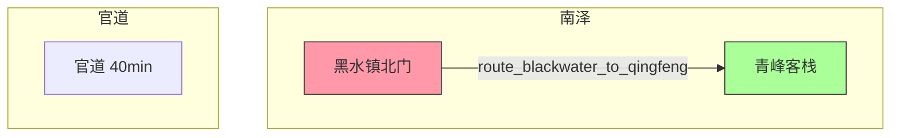

# 地图系统 PRD

> **状态:** 草案 v1.0 · 待评审
> **作者:** StoryForge 设计
> **适用范围:** StoryForge v2.x · `nebula` 分支
> **基线文档:** [`docs/design/地图系统设计.md`](./地图系统设计.md)（输入）,[`docs/design/webmain/DESIGN.md`](./webmain/DESIGN.md)（设计系统）

---

## 0. 元信息与范围

### 0.1 目的

把世界观中的「时代与地理」**机器化**:把 `world.geography` / `world.era_social_structure` / `world.era_cultural_history` / `world.factions` 等自由文本转成结构化、可校验、可回放的地理注册表,作为 Stage 3/4 的强制 context 输入,解决**位置一致、移动合理、地点有戏剧功能**三个核心痛点。

### 0.2 在范围内的功能 (MVP)

| 功能 | 形态 |
|---|---|
| 地图数据模型 | 9 类顶层字段:`regions / locations / routes / pois / location_states / snapshots / footprints / assertions / change_log`(`Map` 是顶层容器) |
| Wizard Step 4 | 替换占位 MapStep,落地表单调优与节点级编辑 |
| 静态图谱 | Mermaid 渲染拓扑图,可点击节点跳转到详情 |
| 地图卡生成 | 每章规划/写作前从当前地图状态生成「地图卡」注入 Writer prompt |
| 写后抽取 | 从正文识别 SF_LOG `character_location_change` + 自由文本 mention,回写 map.json + 生成差异 footprint |
| Fact Guard 地理规则 | **9 条规则**(3 Blocker + 3 Warning + 3 Info),接驳 Stage 4 熔断器 |
| 时间态快照 | 每章 commit 时落 `map_snapshots.json`,回滚到第 N 章可还原完整地图 |
| 与 Stage 3/4 耦合 | wizard.data.map 进入 `STEP_DATA_KEY_TO_STEP`;chapter outline / scene_writing 注入「当前可达地点/路线」context。**默认非强制**(strict_geo=false 不阻断),用户在 MapStep 显式勾选 strict_geo 后 Stage 4 启动硬阻断 |
| 写入前校验 | Writer prompt 内置 6 条地理自查清单(§9.4),LLM 端先自查,Fact Guard 9 条规则终审 |

### 0.3 不在范围内 (Non-Goals)

- 2D/3D 地图可视化(Leaflet / SVG 区域图 / Fog of War)
- 读者侧探索玩法
- 经纬度硬核科幻坐标(模型留 `pos_hint` 字段,但不强制经纬度)
- 多人协作(Yjs / CRDT)
- 室内 / 梦境 / 镜中界子图(留 `space_type` 字段,MVP 仅支持 `room` 与 `world`)
- 实时增量编辑器(走 WorldStep 一样的「生成 / 保存修改」双轨)

### 0.4 范围确认（用户回答）

- 题材侧重: **玄幻 / 修真 / 权谋**(默认)
- MVP 范围: **数据层 + 静态图谱**(Mermaid)
- 存储形态: **单文件 `map.json`**(走 atomic write + checkpoint)
- 下游耦合: **挂入 wizard.data,且作为 Stage 3/4 的强制 context**

### 0.5 向后兼容语义

`map.json` 缺失时(即用户跳过 Step 4 或老项目):`MapSettings.strict_geo` 默认为 `false`,Stage 3/4 的 map_card 段渲染为空字符串,继续走现有路径不阻断。用户在 MapStep 中显式勾选「strict_geo 模式」后,若 map 仍缺失,Stage 4 启动时报错 `MAP_REQUIRED_STRICT_MODE`。详见 §3.1 `MapSettings.strict_geo`。

---

## 1. 核心原则

1. **真相源是图 + 时间态,坐标只是投影**。`canon_pos` (topology + adjacency) 是 truth,`display_pos` 只为静态图谱渲染存在。
2. **历史状态是一等公民**。第 12 章烧毁的客栈,第 40 章回忆杀还能用;第 31 章后的 AI 不该默认它完好。
3. **每个地点必须有戏剧功能**。新增地点必须满足三问:**谁想要这里?这里能改变什么决定?从这里离开会变难还是变贵?** LLM 生成时被强制回答,前端编辑时显示在卡片头部。
4. **坐标策略按尺度分级**。玄幻默认相对位置 + 距离档位(`近/同街/跨区/城外`),长篇用拓扑邻接表 + 通行耗时,科幻才上经纬+投影。
5. **校验失败分级**。`Blocker` 阻熔断器重试,`Warning` 仅记日志+仪表盘,`Info` 不打扰作者。
6. **复用率指标**。每章新增地点上限 N(默认 5)、复用率 ≥ 60%,否则标 `Warning: 可能摊大饼`。

---

## 2. 用户流程

### 2.1 主路径

```
Step 1 创意发散 ─→ Step 2 世界观 ─→ Step 3 角色设计 ─→ **Step 4 地图系统** ─→ Step 5 全书大纲 ─→ Step 6 章节大纲 ─→ 工作台
```

Step 4 的内部子流程:

```
4A 进入(MapStep 空态)
  ↓ (检测到 world.json 已存在)
4B 「基于世界观自动生成初始地图」按钮
  ├── 调 POST /generate-map → 后端 PlannerAgent 生成
  ├── 写入 map.json
  └── 渲染 sub-tab「区域」「地点」「路线」「POI」
  ↓
4C 编辑(节点级 ↻ / 行内修改 / 新增 / 删除)
  ↓
4D 「查看地图」(Mermaid 图谱 modal)
  ↓
4E 「下一步:全书大纲」(saveStep 同时把 wizard.data.map 落 wizard.state)
```

### 2.2 后向补做(用户在 Step 5 之后才补地图)

工作台顶部「项目设置」Tab → 进度条第 4 步亮 ⚠️ → 点跳进 Step 4 → 落地同样流程。补完后 Stage 4 启动时按 `MapSettings.strict_geo` 分流:
- `strict_geo=false`(默认): 仅写 warning 日志,map_card 段为空继续跑
- `strict_geo=true`: 报 `MAP_REQUIRED_STRICT_MODE`,阻断 Stage 4 启动,前端引导用户完成 Step 4

### 2.3 写中调用

```
Writer LLM 接 prompt
  ├── context: 地图卡（地图快照 + 当前可达地点 + 路线 + 禁地 + 戏剧功能提示）
  ├── system: 6 条地理自查清单 (§9.4,LLM 端先自查)
  └── output: 场景文本（含 SF_LOG character_location_change）
    ↓ (Fact Guard 9 条地理规则,§9.1/9.2/9.3)
    ├── pass → 写入 chapter_drafts
    └── fail Blocker → 熔断器 retry(3x),提示信息含规则 ID（如 geo.no_implicit_teleport）
```

### 2.4 写后回写

```
Stage 4 commit chapter
  ├── 抽取: regex 匹配 SF_LOG character_location_change → 写 footprints[chapter]
  ├── 抽取: NER-like mention detection (LLM Tier 3) → 与现有地点别名匹配 → 新增 alias
  ├── 快照: 序列化 map.json → map_snapshots.json.chapter{N}
  └── 校验: route 完整性、density 阈值、orphan POI
```

---

## 3. 数据模型

### 3.1 顶层结构(`map.json`)

```jsonc
{
  "schema_version": "1.0",
  "project_id": "proj_xxx",
  "generated_at": "2026-09-22T10:00:00Z",
  "generated_from": {
    // 均为整文件 SHA-256(full-file or generation),稳定且无需 semantic 解析。
    // 当 world.json 内容变化时,world_version 不一致,触发后续重生流程。
    "world_version": "sha256:abc...",
    "concept_version": "sha256:def...",
    "decompose_version": "sha256:ghi... or null"
  },
  // 核心实体
  "regions": [/* Region[] */],
  "locations": [/* Location[] */],
  "routes": [/* Route[] */],
  "pois": [/* POI[] */],
  // 时间态
  "location_states": [/* LocationState[] */],
  "snapshots": [/* chapter → map_hash 索引 */],
  // 写后抽取
  "footprints": [/* Footprint[] */],
  // 写后校验
  "assertions": [/* MapAssertion[] */],
  // 写入历史
  "change_log": [/* MapChange[] */],
  // 静态图谱展示用(可丢失;用户手动拖动节点后保存,改了重渲染;MVP 不强制)
  "display": {
    "positions": {/* { "<node_id>": {x, y} */},
  },
  // 设定(用户可在 wizard 改)
  "settings": {
    "mode": "strict_geo" | "allow_alias_new" | "freeze_locations",
    "scope": { "enabled": false, "allowed_region_ids": [] },
    "chapter_new_location_cap": 5,
    "reuse_rate_target": 0.6,
    // strict_geo=false (默认): map 缺失时不阻断 Stage 3/4
    // strict_geo=true: 用户显式开启,map 缺失时 Stage 4 启动硬阻断 (MAP_REQUIRED_STRICT_MODE)
    "strict_geo": false
  },
  // 反向索引(运行时从 locations/pois 派生,不持久化,API 读时 build)
  // { name_or_alias → "loc_xxx" | "poi_xxx" },用于把 SF_LOG 的裸 location 字符串归一化到 canonical id
  // §8.1 footprint 抽取、§7.1 map_card 都用这个索引
  "_index": { "name_to_id": { "青峰客栈": "loc_qingfeng_inn", "山脚客栈": "loc_qingfeng_inn" } }
}
```

### 3.2 实体定义

#### 3.2.1 Region(区域)

```json
{
  "id": "region_southern_marsh",
  "name": "南泽",
  "aliases": ["南渊沼泽"],
  "level": "continent" | "state" | "sea" | "star_sector",
  "parent_id": null | "region_xxx",
  "climate": "湿热, 雨季六月至九月",
  "tags": ["低魔区", "势力真空", "地形复杂"],
  "controlled_by": ["faction_漕帮"],
  "adjacent_region_ids": ["region_eastern_plain", "region_blackwater_basin"],
  "display_pos": { "x": 320, "y": 480 }   // Mermaid 缓存用
}
```

#### 3.2.2 Location(地点)

```json
{
  "id": "loc_qingfeng_inn",
  "name": "青峰客栈",
  "aliases": ["山脚客栈", "悦来分号"],
  "type": "city" | "town" | "village" | "inn" | "temple" | "sect" | "wilds" | "room" | "starport" | "secret_realm",
  "region_id": "region_southern_marsh",
  "pos_hint": "青峰山南麓, 距官道半里, 黑水镇北门外",
  "tags": ["落脚点", "情报", "低危险"],
  "factions": [{ "faction_id": "faction_漕帮", "attitude": "friendly" }],
  "enter_conditions": ["夜里需暗号", "掌柜认得女主"],
  "secrets": ["地窖通 loc_abandoned_temple"],
  // 戏剧功能(三问,LLM 必填,前端编辑时显示在卡片头部)
  "dramatic_role": {
    "wanted_by": ["faction_盐铁司: 掌柜窝藏朝廷钦犯"],
    "decisions_unlocked": ["加入漕帮", "举报女主"],
    "departure_cost": "丢失已付定金 + 暴露行踪"
  },
  "space_type": "world" | "room",       // 默认 "world"; MVP 仅支持这两个值
  "display_pos": { "x": 480, "y": 320 }
}
```

#### 3.2.3 Route(路线)

```json
{
  "id": "route_blackwater_to_qingfeng",
  "from": "loc_blackwater_gate",
  "to": "loc_qingfeng_inn",
  "bidirectional": true,
  "kind": "road" | "waterway" | "tunnel" | "portal" | "starlane" | "secret_path",
  "distance_tier": "intra_city" | "inter_city" | "inter_region" | "inter_continent",
  "est_travel_minutes": 40,
  "risk": "low" | "mid" | "high",
  "conditions": ["夜行需灯笼", "雨季封路"],
  "encounters": ["盐铁司巡检", "山贼"],
  "accessible": true
}
```

#### 3.2.4 POI(兴趣点)

```json
{
  "id": "poi_qingfeng_inn_cellar",
  "name": "青峰客栈地窖",
  "parent_location_id": "loc_qingfeng_inn",
  "kind": "shrine" | "cache" | "crime_scene" | "resource" | "view" | "trap",
  "description": "可通往 loc_abandoned_temple 的暗道入口",
  "discoverable": true,
  "first_discovered_chapter": 12,
  "tags": ["密道", "伏笔"]
}
```

> **未发现 POI 的可见性约束**:`discoverable=false` 的 POI **不进 Writer prompt**(地图卡 / scene context 都不携带);Mermaid 图谱节点默认也不渲染,仅作者侧「显示全部」开关可见。`discoverable=true` 但 `first_discovered_chapter=null` 的 POI 视为「待发现」,出现在地图卡但标注 `[未发现]`,Writer 不得在 `first_discovered_chapter` 之前的章节文本中点名提及。

#### 3.2.5 LocationState(时间态)

```json
{
  "location_id": "loc_qingfeng_inn",
  "chapter": 12,
  "faction_id": "faction_盐铁司",
  "name": "废墟",                // 直书站已毁,可读出
  "accessible": false,
  "destroyed": true,
  "note": "第 12 章被官军纵火"
}
```

> 同样的 `location_id` 在不同章节可以有多条 `LocationState`,最近一条胜出。
> 
> **默认 accessible:** 若某 `location_id` 在 `location_states[]` 中无任何记录,默认 `accessible=true`(从未被毁/封锁)。`geo.forbidden_access` 规则(§9.1)查「该 location 的 latest LocationState 的 `accessible`」,无记录时视为 true。

#### 3.2.6 Snapshot(章节快照索引)

```json
{
  "chapter": 12,
  "map_hash": "sha256:abc...",
  "snapshot_path": "map_snapshots/chapter_12.json"
}
```

> 真正的快照内容落地到 `map_snapshots/chapter_N.json` 单独文件,避免 `map.json` 体积爆炸。`map.json.snapshots[]` 只存索引。

#### 3.2.7 Footprint(足迹)

```json
{
  "chapter": 8,
  "character_id": "char_protagonist",
  "location_id": "loc_qingfeng_inn",
  "arrived_via": "route_blackwater_to_qingfeng",
  "departed_to": "loc_abandoned_temple",
  "companions": ["char_xiaoqi"],
  "time_of_day": "亥时",
  "weather": "小雨"
}
```

#### 3.2.8 MapAssertion(校验结果)

```json
{
  "id": "assert_xyz",
  "chapter": 23,
  "kind": "blocker" | "warning" | "info",
  "rule_id": "geo.no_implicit_teleport",
  "message": "角色 7 步内从 loc_qingfeng_inn 跳到 loc_capital, 无可用 route",
  "evidence": {
    "scene_text_excerpt": "...",
    "available_routes": []
  },
  "resolution": "未处理" | "已修复" | "用户豁免"
}
```

#### 3.2.9 MapChange(写入历史)

```json
{
  "ts": "2026-09-22T10:00:00Z",
  "actor": "user" | "system" | "regenerate_map_section" | "sf_log_extraction",
  "chapter": 12,
  "op": "create" | "update" | "delete" | "alias_add" | "state_change",
  "entity": "location" | "route" | "poi",
  "entity_id": "loc_xxx",
  "before": null | {...},
  "after": {...}
}
```

> `change_log` 是事件溯源表,「回到第 N 章重写」按 chapter 反向 replay 到目标章节即可。

---

## 4. 存储形态

### 4.1 文件布局

```
projects/<project_id>/
  world.json
  characters.json
  **map.json**                       ← 新增
  map_snapshots/
    chapter_001.json                 ← 新增
    chapter_002.json
    ...
  outline.json
  novel_outline.json
  ...
```

### 4.2 为什么单文件而非多文件

| 维度 | 单文件 `map.json` | 多文件 `map/*.json` |
|---|---|---|
| Atomic write | ✅ FileManager 既有路径 | ❌ 要么多文件事务(复杂),要么各自 atomic(失败回滚不一致) |
| Wizard 状态机 | ✅ `map.json` 一个文件 = 一个 stage | ⚠️ 要新增 stage 概念 |
| 章节回滚 | ✅ `change_log` reverse-replay 一份文件 | ⚠️ 多个文件合并还原 |
| 体量 | ⚠️ 长篇可能 100-300 KB,可接受 | ✅ 各自轻量 |
| 查询 | ⚠️ 全文读+filter | ✅ 按需读 |
| **MVP 决策** | ✅ 选这个 | — |

### 4.3 Atomic write

`map.json` 沿用 FileManager 的 `.tmp` + replace 模式。`change_log` 追加写(每次更新追加一条,不走 replace)。

### 4.5 检查点集成

`.storyforge_checkpoint.json` 的快照字段新增 `map_snapshot_hash`(chapter N 的 map hash)。Stage 4 启动时比对当前 `map.json` hash 是否与 checkpoint 一致,不一致则报警(避免 checkpoint 指向已不存在的地图状态)。

---

## 5. UI/UX 设计

### 5.1 Step 4「地图系统」结构

复用 WorldStep 的 `tablist + sub-tab + card` 模式:

```
┌──────────────────────────────────────────────────────┐
│  Tab  区域  地点  路线  POI  快照      [查看地图]    │
├──────────────────────────────────────────────────────┤
│  Sub-Tab  (按当前 Tab 显示不同 panel)                │
│                                                      │
│  地点 Tab:                                           │
│    ┌──────────────────────────────────────────────┐ │
│    │ loc_blackwater_gate     黑水镇北门  ↻ 🗑      │ │
│    │ 类型: 关隘   区域: 南泽                      │ │
│    │ pos_hint: 黑水镇北侧城墙豁口                  │ │
│    │ 戏剧功能: 谁想要这里 / 改变什么 / 离开代价   │ │
│    │ 进入条件: [夜里需暗号]  [+]                   │ │
│    │ 别名: [北关] [山门]                          │ │
│    └──────────────────────────────────────────────┘ │
│                                                      │
│  [ + 添加地点 ]                                      │
└──────────────────────────────────────────────────────┘
```

### 5.2 5 个 Tab 的内容

| Tab | 内容 | 主要交互 |
|---|---|---|
| 区域 | region 卡片列表 | 邻接关系可视化编辑(从 dropdown 选其他 region 互邻) |
| 地点 | location 卡片列表 | 戏剧功能必填、别名、enter_conditions、secrets(指向其他 location id) |
| 路线 | route 列表(分组 by from_location) | 双向/单向、距离档位、通行耗时、风险、conditions |
| POI | poi 列表(从属 location 树状) | 父地点下拉、首次发现章节 |
| 快照 | chapter → map_hash 表 | 只读;支持「回滚到第 N 章」确认 modal |

### 5.3 静态图谱(Mermaid modal)

点击右上「查看地图」按钮打开 modal:



- 节点 = location,边 = route
- 区域 = Mermaid subgraph
- 颜色: 类型(city/inn/sect/secret_realm)各有底色
- 已毁 location 加删除线 + 灰色
- 点击节点 → 关 modal 跳到对应 location 卡片

### 5.4 戏剧功能「三问」高亮

每个 Location 卡片头部展示三问的答案(LLM 生成时强制填)。这三问答案在地图卡中会作为 Writer 的「戏剧张力提示」再次出现。

### 5.5 视觉规范

沿用 `frontend/src/components/ds/` 的设计系统:
- Tab 容器:`PanelCard`
- 主操作按钮:`PrimaryButton` (生成初始地图)
- 卡片内修改: `GhostButton` (行内编辑)、`SecondaryButton` (保存修改)
- POI 树: `SidebarNavItem` 风格
- 图谱 modal: 现有 `Modal` 基础组件 + 内嵌 `<pre className="mermaid">`,前端 `mermaid.render()` 渲染成 SVG

---

## 6. 写入前:生成与编辑

### 6.1 初始生成

`POST /api/stage2/generate-map`(放在 stage2_world_char.py 同 router)

**输入:** `project_id`、`user_modifications`(可选)
**Prompt 模板:** `backend/prompts/map_generation.yaml`
**输入上下文:**

```yaml
world_era: "<world.era>"
world_geography: "<world.geography>"
world_social_structure: "<world.era_social_structure>"
world_cultural_history: "<world.era_cultural_history>"
world_factions: "<world.factions[] 全字段: name / type / goal / relations>"
world_power_systems: "<world.power_systems[].name + source 各自 provider>"
characters_locations: "<characters[].current_state.location>"
b3_dimensions: "<_load_decompose_data output>"
```

**Prompt 强制项:**

1. 节点数量控制:**5-15 个 region**,**20-40 个 location**(超出警告,用户确认才落)
2. 每个 location 必须填 `dramatic_role` 三问答案
3. route 必须连接至少一对 location,且不可自环
4. POI 数量 ≤ location 数量的 30%
5. **不允许地点出现在 `world.factions[].controlled_by` 直接控制的 region 内且与该 faction 的 attitude 为 `hostile`**(即 LLM 端不得把主角宗门所在城塞给敌对宗门;LLM 端先自检,Fact Guard 终审)
6. **每个 location 的 `pos_hint` 必须显式引用至少一个已存在的 region 或 location**(避免孤立节点)
7. **空间类型标签**(MVP): 所有地点必须打 `space_type: "world"` 或 `"room"` 之一,默认 `"world"`

**输出:** 直接落 `map.json`,沿用 World.model_validate 的防御性 pattern。

### 6.2 单点重生

`POST /api/stage2/regenerate-map-section`

```python
class RegenerateMapSectionPayload(BaseModel):
    section: Literal["regions", "locations", "routes", "pois"]
    # sub-key: locations 时可指定 location_index, routes 时 route_index
    index: Optional[int] = None
    user_modifications: str = Field(default="", max_length=1700)
```

- `section="all"` 全量重生(初始生成用)
- `section="locations", index=N` 仅重生第 N 个 location(其他 byte-preserve)
- `section="routes"` 时 index 不生效(整组重生,避免破坏 from/to 引用)

### 6.3 行内编辑

- 字段级 edit → debounce 500ms → `PATCH /api/stage2/map/location/{id}` 局部更新
  - **与 WorldStep 模式分叉的代价说明**:WorldStep 用「本地 setState + 点击保存修改」整盘 PUT;MapStep 因为节点数 20-40,改一字段 PUT 整盘 token 太贵 + Mermaid 缓存脏读概率高,因此采用 debounce PATCH。**WorldStep 后续可跟进统一** (follow-up issue,不属于本 PRD)。
- 新增 / 删除 → `POST /api/stage2/map/location` / `DELETE /api/stage2/map/location/{id}`
  - **POST 时 `id` 不由前端传**,后端自动生成 `loc_<8位 base36 uuid>`(沿用 `proj_<8位>` 现有模式)。前端若传 `id` 则后端校验唯一性后写入。
  - 删除 location 时若有 route 引用,后端 return 422 `LOCATION_REFERENCED_BY_ROUTES`,前端弹 modal「请先删除相关路线」
- `project_id` 沿用 stage2 既有 `Query(...)` 风格(`/api/stage2/map/location/{id}?project_id=...`)

---

## 7. 写入中:地图卡与 SF_LOG

### 7.1 地图卡生成

新模块 `backend/map_system/map_card.py`(放在 `backend/map_system/` 目录,与 `memory_os/` 同级)

**输入参数:**

- `project_id`
- `chapter_number`(用于取 chapter N 的 map snapshot)
- `scene_number`(M≥1,1 表示 chapter 起始)
- `characters[]` 的 `current_state.location`(裸字符串名,非 id)
- `chapter_drafts/chapter_NN/scene_<scene_number-1>.txt`(若有,从已写场景的 SF_LOG 抽取本场起始位置增量)

**依赖边界(单向,避免与 outline_context 互引):** `build_map_card()` 只读 `map.json` + `characters.json` + `outline.scene_plan`(直读文件),**不导入** `outline_context` 模块;反之 `outline_context/builder.py` 调用 `build_map_card()`。这样循环依赖断开。

**实现语义:** `build_map_card` 是**纯 deterministic / sync 函数**(无 LLM 调用,Pydantic model_validate + 字符串模板)。`stage4_async_executor` 调用时不需要进入 await 上下文;同步形式更便于 unit test mock。

**输出:** 字符串。长度 ~300-500 tokens(≤ 30 location 时); ≥ 30 location 时按 §14.2 Q4 的 N-跳邻接裁剪(详见该问题)。

**生成模板:**

```text
【地图卡 · 第{N}章 · 场景{M}】
当前章节尺度: {scale}        // 从 outline.scene_plan 或 scene_goal 推断(room/city/region/continent)
当前时间: {chapter_time_of_day}    // 从 outline 推断,默认 "未指定"
季节: {chapter_season}             // 默认 "未指定"

当前位置(从 chapter_base_state + scene 1..M-1 的 SF_LOG character_location_change 增量累计):
- {character_id_1} @ {location_name_1} (进入条件: ...)
- {character_id_2} @ {location_name_2}

可移动选项(基于当前位置 + route 表):
- {route_a}: 耗时 {est_travel_minutes}, 风险 {risk}, 触发 {encounters|无}
- {route_b}: ...
- 禁地: {inaccessible_location_with_reason}

地点戏剧功能提示(Writer 不要平铺,要让主角感受到地点的「代价」):
- {location_name}: 想来的人 = {wanted_by}; 离开代价 = {departure_cost}

一致性提醒(从 Footprints 抽取最近 5 章;chapter < 6 该段为空,footprints 尚未积累):
- {chapter_N-1}: {character} 经 {route_a} 到达 {location}
- 第 X 章已毁:{location}"

SF_LOG 标签提醒(若本章涉及移动):
- character_location_change 必填,from / to 用裸 location 名(后端 alias 索引归一化);via 可选(见 §7.2)

地图设定(用户在 MapStep 改过则生效):
- mode = {strict_geo | allow_alias_new | freeze_locations}
- 本卷作用域 = {allowed_region_ids[]}
- 新增地点上限 = {chapter_new_location_cap}
```

**注入路径:**

- `outline_context/builder.py` 在组装 chapter outline context 时,调用 `build_map_card(...)` 并把字符串作为新块追加
- `memory_os/memory_coordinator.py:assemble_for_scene` 在 L2 之后追加 `map_card`(独立字符串,不入 L1/L2 cache,因为地图快照每章变)
- `prompts/scene_writing.yaml` `user_prompt_template` 新增 `{map_card}` 占位

### 7.2 SF_LOG `character_location_change` 已有契约确认

CLAUDE.md 已有定义:
```
character_location_change: char="角色名" from="原位置" to="新位置"
```

**`via` 扩展(信息性,不进状态机):**

- `backend/agents/storyos_agent.py:385-390` 的 `_handle_character_location_change` 只读 `char` + `to`,**完全忽略 `via`**。parser(`backend/models/sf_log.py`)无 allowed_keys 白名单,只通过 `.get()` 取值。
- 因此 `via="route_xxx"` 字段:**Writer 可填,纯信息性,只用于 Mermaid 图谱回放和人类 debug;不影响 StoryOS 状态机、不参与 footprint 抽取**。
- spec 不应在提示文案里暗示 `via` 会改变什么。

### 7.3 新增 SF_LOG 类型(MVP 不引入,记入 backlog)

> Backlog: `location_state_change`(地点被毁/封锁/重命名)、`poi_discover`(POI 首次发现)、`route_block`(路线临时封禁)。
> MVP 阶段这三类事件由写后抽取自动推断,不强制 SF_LOG。

---

## 8. 写入后:抽取与快照

### 8.1 SF_LOG 抽取(已有路径扩展)

调用点:`stage4_async_executor.assemble_for_chapter_advance` 末尾(参考现有 L3 indexing / L4 sync 调用位置),章节 commit 时触发:

1. 正则提取 `character_location_change` 标签
2. 对每条记录:
   - `char` → 匹配 character list
   - `from` / `to` 是裸字符串名(如 "青峰客栈"),**不是 location_id**;通过 §3.1 的 `name_to_id` 反向索引(从 `locations[].name` + `locations[].aliases[]` + `regions[].name` 派生,build 在内存)归一化到 canonical `location_id`
     - 命中:写 `footprints[]`(location_id 形式),同时更新 `characters[i].current_state.location`(裸名,与现状一致 — StoryOS 现有 `_handle_character_location_change` 行为保留)
     - 不命中(新地点)且 `mode != "freeze_locations"`:自动 `create location`(auto-id `loc_<8位 base36>`),写 `change_log`,UI 标 🔔 待用户确认
     - 不命中且 `mode == "freeze_locations"`:记 `geo.alias_added` Info,**不自动建**,UI 弹 modal 让用户决策
3. `change_log` 追加 `op=create` 或 `op=update` 记录

### 8.2 自由文本 mention 抽取(LLM Tier 3)

mention extraction **始终启用**,所有 mode 都跑。但**自动落 `map.json` 的策略**按 mode 分流:

- 输入:本场场景文本
- LLM 调用:`extract_location_mentions(text)`(新 prompt `backend/prompts/location_mention_extraction.yaml`,Tier 3)
- 输出:`[{raw_mention: "北关", canonical_id: "loc_blackwater_gate" | "NEW", confidence: 0.0-1.0}]`
- 后处理:
  - `confidence >= 0.85` 且 `canonical_id="NEW"`:
    - `mode="allow_alias_new"`:自动 `create location`,写 `change_log`,UI 标 🔔 待审
    - `mode="strict_geo"` / `"freeze_locations"`:仅写 `change_log`,**不自动建**,UI 弹 modal 让用户决策
  - `confidence >= 0.85` 且匹配 canonical:写 `aliases[]` 增量更新(all modes)

### 8.3 章节快照

每章 Stage 4 commit 完成时:

```python
def snapshot_map_at_chapter(project_id, chapter):
    map_data = load_map(project_id)
    map_data.pop('snapshots', None)        # 去掉索引本身避免递归
    map_data.pop('change_log', None)        # 同上
    snapshot_path = f"map_snapshots/chapter_{chapter:03d}.json"
    atomic_write_json(snapshot_path, map_data)
    snapshots_index = compute_map_hash(map_data)
    append_to_map_json({
        "snapshots": [{"chapter": chapter, "map_hash": snapshots_index, "snapshot_path": snapshot_path}]
    })
```

### 8.4 回滚到第 N 章

用户在工作台「地图快照」Tab 选 N → 确认 modal「将丢弃第 N 章之后的所有地图变更」→ 后端:

1. 加载 `map_snapshots/chapter_N.json`
2. 截断 `change_log` 到 chapter N
3. 重写 `map.json`
4. 重写 `.storyforge_checkpoint.json` 的 `map_snapshot_hash` 字段

---

## 9. 校验规则(Fact Guard)

新模块 `backend/map_system/assertions.py`。注册到 Stage 4 fact-guard pipeline(`backend/api/stage4_fact_guard.py`)。

### 9.1 Blocker(熔断器重试)

| 规则 ID | 描述 | 检测方式 |
|---|---|---|
| `geo.no_implicit_teleport` | 角色移动后 from→to 无 route 可达 | BFS 当前 location 邻接表 + route 表 |
| `geo.forbidden_access` | 角色进入 `accessible=false` 的 location 且缺 enter_conditions 解除记录 | 查 `location_states[location_id][latest].accessible` + 该 location 的 `enter_conditions`;**不需要 SF_LOG**(MVP 不引入 location_state_change,见 §7.3) |
| `geo.time_budget_exceeded` | 单章内累计移动耗时 > outline 该章 time_budget | 累加本场出现的所有 route 的 est_travel_minutes |

### 9.2 Warning(仅记日志+仪表盘)

| 规则 ID | 描述 |
|---|---|
| `geo.high_new_location_count` | 单章新增 location 数 > settings.chapter_new_location_cap |
| `geo.low_reuse_rate` | 滚动 5 章复用率 < settings.reuse_rate_target(默认 0.6) |
| `geo.region_density_high` | 单个 region 内 location 数 > 20 |

### 9.3 Info

| 规则 ID | 描述 |
|---|---|
| `geo.alias_added` | mention 抽取新增 alias |
| `geo.poi_discovered` | 自由文本中提到 POI 但未填 `first_discovered_chapter` |
| `geo.faction_attitude_shift` | location.factions 中态度与 world.factions 中口风不一致 |

### 9.4 Writer 自查清单(写入 prompt 内)

`prompts/scene_writing.yaml` 的 system_prompt 末尾追加:

```text
【地理自查清单 — 写作前先核对】
1. 角色当前位置是否在本章起点声明
2. 每次移动是否经过已有 route,无则 SF_LOG from/to 必须一致
3. 是否避开了 accessible=false 的 location(除非有 enter_conditions 解除)
4. 是否遵守「每章新增地点上限」(默认 5)
5. 移动耗时是否在本章 time_budget 内
6. 离开 location 时是否在文中体现「代价」
```

---

## 10. Prompt 模板

### 10.1 新增 `backend/prompts/map_generation.yaml`

| 字段 | 值 |
|---|---|
| name | map_generation |
| provider | deepseek |
| model | deepseek-chat |
| temperature | 0.7 |
| negative_constraints | 「不要输出任何除 JSON 外的文字」 |
| system_prompt | 见 §6.1 强制项 + 戏剧功能三问模板 |
| user_prompt_template | 见 §6.1 输入上下文 |
| output_format | 见 §3.1 顶层结构 |

> **关于 tier(与 PRD 初稿不同):** tier **不是** prompt YAML 字段,而是由 `model_router.py` 的 `agent_mapping` 按 agent_name 路由(`map_generation` 由 PlannerAgent 承载)。MVP 默认沿用 world_generation 的 tier(Tier 2,低成本)。**戏剧功能问答对质量要求更高时**,在 `agent_mapping` 把 `map_generation` 独立成 `tier_1` task 而不是改 prompt YAML — 同一 prompt 不能分 tier。

### 10.2 新增 `backend/prompts/location_mention_extraction.yaml`

| 字段 | 值 |
|---|---|
| name | location_mention_extraction |
| model | claude-haiku |
| temperature | 0.2 |
| output | `[{raw_mention, canonical_id, confidence}]` |

> **关于 tier:** 同 §10.1,实际 tier 由 `agent_mapping` 决定(`location_mention_extraction` 作为 Tier 3 task)。prompt YAML 中不写 tier 字段。

### 10.3 修改 `prompts/scene_writing.yaml`

- `user_prompt_template` 新增 `{map_card}` 占位
- system_prompt 末尾追加 §9.4 自查清单
- 在「相关历史文本片段」之前插入「POI 不可见约束」提示:
  ```
  POI 未发现约束: discoverable=false 的 POI 不在本文中提及;
                  first_discovered_chapter=本场之前章节的 POI 可自由使用;
                  first_discovered_chapter=本场或之后章节的 POI 不可在文中点名(标注 [未发现])。
  ```

### 10.4 修改 `prompts/world_generation.yaml`(可选)

world.geography 输出已经是 free-text blob,MVP 阶段不动。但 plan 里可建议在 geography 后追加 hint:

```yaml
world_geography_hint: "本字段为自由文本描述,会被 Step 4 地图系统结构化为 region/location/route。"
```

避免下游 LLM 误以为 geography 已经是结构化数据。

---

## 11. API 设计

### 11.1 新增端点(挂在 `backend/api/stage2_world_char.py` 同 router,prefix `/api/stage2`)

| 方法 | 路径 | 用途 | 入参 | 出参 |
|---|---|---|---|---|
| GET | `/map` | 读完整 map.json | `project_id` | `Map` |
| POST | `/generate-map` | 初始生成(Step 4 顶部 CTA) | `{project_id, user_modifications?}` | `Map` |
| PUT | `/map` | 整盘保存(WorldStep 风格,Step 4 「保存修改」) | `{project_id, map}` | `Map` |
| PATCH | `/map/location/{id}` | 行内编辑单个 location | `LocationPatch` | `Location` |
| PATCH | `/map/route/{id}` | 行内编辑单个 route | `RoutePatch` | `Route` |
| POST | `/map/location` | 新增 location | `{project_id, location}` | `Location` |
| DELETE | `/map/location/{id}` | 删除 location(若有 route 引用 → 422) | `project_id` | `{deleted_id, cascaded_route_removals}` |
| POST | `/map/route` | 新增 route | `{project_id, route}` | `Route` |
| DELETE | `/map/route/{id}` | 删除 route | `project_id` | `{deleted_id}` |
| POST | `/regenerate-map-section` | section 级重生 | `{project_id, section, index?, user_modifications?}` | `Map` |
| GET | `/map/snapshot/{chapter}` | 取第 N 章快照 | `project_id` | `Map` |
| POST | `/map/rollback/{chapter}` | 回滚到第 N 章 | `project_id` | `Map` |
| GET | `/map/mermaid` | **删除,改前端从 `/map` 自行渲染** | — | — |

> **说明:** < 100 节点规模下,Mermaid 渲染 CPU 成本 < 100ms,且后端缓存与 map.json 状态一致性维护成本高(`map.json` 改一字段 → cache 失效)。MVP 阶段让前端直接用 `getMap()` 拿数据 + `mermaid.render()` 渲染,后端不存 mermaid 字符串。deletion cache `display.mermaid_cache` 也从 §3.1 顶层结构中删除。

### 11.2 修改端点

| 方法 | 路径 | 改动 |
|---|---|---|
| GET | `/api/stage2/world` | 无,保留 |
| POST | `/api/stage2/generate-world` | 无,保留 |
| POST | `/api/stage4/fact-guard` | 新增地理规则注册点(见 §9) |
| GET | `/api/stage3/...` | outline context 组装时注入 map_card(见 §7.1) |

### 11.3 Pydantic 模型(`backend/models/map.py` 新建)

> 完整类:`Region` / `POI` / `LocationState` / `SnapshotIndex` / `Footprint` / `MapAssertion` / `MapChange` / `DisplayMeta` / `MapSettings` / `FactionStance` 的字段在 §3.2 实体定义中给出,严格按 JSON 字段命名;此处仅列骨架与 `Location` / `Route` / `DramaticRole` / `Map` 完整定义作为实现样板。

```python
    id: str = Field(pattern=r'^loc_[a-z0-9_]+$')
    name: str
    aliases: list[str] = []
    type: Literal["city", "town", "village", "inn", "temple", "sect",
                  "wilds", "room", "starport", "secret_realm"]
    region_id: Optional[str] = None
    pos_hint: str = ""
    tags: list[str] = []
    factions: list[FactionStance] = []
    enter_conditions: list[str] = []
    secrets: list[str] = []      # 其他 location id
    dramatic_role: DramaticRole
    space_type: Literal["world", "room"] = "world"
    display_pos: Optional[DisplayPos] = None

class DramaticRole(BaseModel):
    wanted_by: list[str] = []
    decisions_unlocked: list[str] = []
    departure_cost: str = ""

class FactionStance(BaseModel):
    faction_id: str
    attitude: Literal["friendly", "hostile", "neutral", "wary"]

class Route(BaseModel):
    id: str = Field(pattern=r'^route_[a-z0-9_]+$')
    from_id: str = Field(alias="from")
    to_id: str = Field(alias="to")
    bidirectional: bool = True
    kind: Literal["road", "waterway", "tunnel", "portal", "starlane", "secret_path"]
    distance_tier: Literal["intra_city", "inter_city", "inter_region", "inter_continent"]
    est_travel_minutes: int = Field(ge=0)
    risk: Literal["low", "mid", "high"] = "low"
    conditions: list[str] = []
    encounters: list[str] = []
    accessible: bool = True

class Map(BaseModel):
    schema_version: Literal["1.0"]
    project_id: str
    regions: list[Region] = []
    locations: list[Location] = []
    routes: list[Route] = []
    pois: list[POI] = []
    location_states: list[LocationState] = []
    snapshots: list[SnapshotIndex] = []
    footprints: list[Footprint] = []
    assertions: list[MapAssertion] = []
    change_log: list[MapChange] = []
    display: DisplayMeta = DisplayMeta()
    settings: MapSettings = MapSettings()

    @model_validator(mode="after")
    def _validate_references(self):
        # 检查 routes.from_id / routes.to_id / locations.region_id
        # / pois.parent_location_id / location_states.location_id 都命中
        return self
```

### 11.4 Fact Guard 集成

> **与 PRD 初稿不同的事实:** `backend/agents/reviewer.py` **没有 Rule 抽象类**。现有 6 条 check 是 `ReviewerAgent` 的硬编码方法(`check_1_timeline` ... `check_6_semantic_precheck_review`),`/api/stage4/fact-guard` 只是薄 wrapper。新接入方式:在 `ReviewerAgent` 中加 `check_7_geo` 系列方法,与现有 check_1-6 同级,在 `run_fact_guard` 末尾追加一段「geo assertions」聚合,返回结果合并到 `fg_result.checks`。
>
> 若想引入抽象类以减少重复,需先做一次 `ReviewerAgent` 重构(超出本 PRD 范围,记入 backlog)。

**新增 9 条规则(§9.1/9.2/9.3 全部):**

| # | 方法名 | 类型 | 规则 ID |
|---|---|---|---|
| 1 | `check_7_geo_no_implicit_teleport` | Blocker | `geo.no_implicit_teleport` |
| 2 | `check_7_geo_forbidden_access` | Blocker | `geo.forbidden_access` |
| 3 | `check_7_geo_time_budget_exceeded` | Blocker | `geo.time_budget_exceeded` |
| 4 | `check_7_geo_high_new_location_count` | Warning | `geo.high_new_location_count` |
| 5 | `check_7_geo_low_reuse_rate` | Warning | `geo.low_reuse_rate` |
| 6 | `check_7_geo_region_density_high` | Warning | `geo.region_density_high` |
| 7 | `check_7_geo_alias_added` | Info | `geo.alias_added` |
| 8 | `check_7_geo_poi_discovered` | Info | `geo.poi_discovered` |
| 9 | `check_7_geo_faction_attitude_shift` | Info | `geo.faction_attitude_shift` |

每个 check 方法签名与现有 check_1-6 一致:

```python
def check_7_geo_xxx(self, draft_text: str, ...) -> CheckResult:
    # 返回 CheckResult(name=..., passed=..., kind=..., detail=...)
```

**CheckResult 扩展:** `backend/agents/reviewer.py:24 class CheckResult:` 当前无 `kind` 字段。需在 Pydantic/dataclass 中加 `kind: Literal["blocker", "warning", "info"]`,现有 6 条 check 全部默认填 `"warning"`(行为不变,熔断器只看 `passed`)。

聚合入口:`ReviewerAgent.run_fact_guard` 末尾:

```python
geo_checks = [
    self.check_7_geo_no_implicit_teleport(draft_text, characters, map_snapshot, scene_plan),
    self.check_7_geo_forbidden_access(...),
    # ... 9 条
]
all_checks = existing_checks + geo_checks
geo_blockers = [c for c in geo_checks if not c.passed and c.kind == "blocker"]
if geo_blockers:
    fg_result.all_passed = False
fg_result.checks = all_checks
```

**优先级:** Blocker > Warning > Info(沿用现有 `FactGuard.all_passed` 语义,只要有任一 Blocker 失败即整体 fail,触发熔断器重试)。

---

## 12. 与现有系统集成点

### 12.1 WizardContext 改动

```typescript
// frontend/src/components/wizard/WizardContext.tsx
interface WizardData {
  // ... existing
  map: Map | null;        // ←新增
}

// STEP_DATA_KEY_TO_STEP 新增:
map: 4,   // Step 4 拥有 map 字段

// InitWizardModal prefill 新增:
const mapRes = await api.getMap(projectId).catch(() => null);
if (mapRes && hasContent(mapRes)) {
  completed.push(4);
  data.map = mapRes;
}
```

### 12.2 WizardSidebar 改动

`frontend/src/components/wizard/WizardSidebar.tsx` 把「地图系统」step 4 的导航按钮加上 `data-testid="wizard-step-4"`。无障碍属性沿用其他 step。

### 12.3 Writer prompt 改动

`prompts/scene_writing.yaml`:
- `user_prompt_template` 新增 `{map_card}` 占位
- `system_prompt` 末尾新增 §9.4 自查清单

`backend/conductor/stage4_async_executor.py`(或 writer agent 入口):
```python
async def _build_scene_context(...):
    ctx = memory.assemble_for_scene(...)
    # build_map_card 是 sync,不需要 await(详见 §7.1 实现语义)
    map_card = build_map_card(project_id, chapter_number, scene_number)
    return {**ctx, "map_card": map_card}
```

### 12.4 Outline context 改动

`backend/outline_context/builder.py`:
```python
def build_chapter_outline_context(project_id, chapter):
    ...
    # scene_number=1:chapter 起始场景(无已写场景可累计)
    map_card = build_map_card(project_id, chapter, scene_number=1)
    return f"{base_context}\n\n【地图卡】\n{map_card}"
```

> 与 §7.1 / §12.3 共用同一个 `build_map_card` 函数;参数签名 `(project_id, chapter_number, scene_number=1, character_locations=None)`。

### 12.5 Prompt Plaza / agent_mapping 集成

`backend/api/prompt_plaza.py` 把新 prompt 文件加入 YAML 列表(让用户在 Prompt Plaza 中可调):
- `map_generation`
- `location_mention_extraction`

**tier 不在 `prompt_defaults.py` 设置**(那里只放 default 内容)。tier 走 `config/model_tiers.yaml` 的 `agent_mapping`,按 agent_name 路由:

```yaml
agent_mapping:
  planner:
    map_generation: tier_2           # MVP 默认;质量不达标时升级为 tier_1
    location_mention_extraction: tier_3
  # ... 其他 agent 路由不变
```

> 这与现有 world_generation / character_generation 走 PlannerAgent 不同 task 的模式一致(`config/model_tiers.yaml` 已为 PlannerAgent 切分了 `world_generation` / `character_generation` / `outline_generation` 等 task),新增两个 task 不改 agent_mapping 整体结构。

### 12.6 SF_LOG extractor 改动

`backend/agents/summary_archiver.py` 或新增 `backend/map_system/extract_locations.py`:
- 解析 `character_location_change` 标签 → 写 footprint
- 维护 alias map

---

## 13. 测试与验收指标

### 13.1 单元测试(目标 30+ 用例)

**后端(`backend/tests/test_map_*.py`):**

| 文件 | 覆盖 |
|---|---|
| `test_map_model.py` | Map / Location / Route / Region / POI 的 Pydantic 校验、reference integrity、alias normalize |
| `test_map_api.py` | 12 个新增端点(已删除 `/map/mermaid`)的 happy path + 关键错误码(422 LOCATION_REFERENCED_BY_ROUTES 等) |
| `test_map_card.py` | 地图卡生成: 4 个尺度(room/city/region/continent) + scene-level 增量累计 |
| `test_fact_guard_geo.py` | 9 条规则各 2 用例 + 跨规则优先级(Blocker > Warning > Info) |
| `test_map_extraction.py` | SF_LOG 解析 + LLM mention 抽取 mock + change_log 拼接 + alias 反向索引 |
| `test_map_snapshot.py` | 回滚到第 N 章的还原正确性 + change_log 截断 + checkpoint hash 同步 |

**前端(`frontend/src/components/wizard/MapStep.test.tsx`):**

| 文件 | 覆盖 |
|---|---|
| `MapStep.test.tsx` | Step 4 主流程: 空态 → 生成按钮 → 5 个 Tab 切换 → 行内编辑 → 「查看地图」modal |
| `MapStep.4B.generating.test.tsx` | 4B 初始生成失败 / 成功重试 / 5-15 region + 20-40 location 警告 |
| `MapStep.mermaid.test.tsx` | 「查看地图」modal 渲染 + 节点点击跳转 |

### 13.2 集成测试

| 场景 | 期望 |
|---|---|
| 完整走 Step 4 → Stage 3 → Stage 4 写第一章 | 地图卡正确注入,Footprint 正确落,fact-guard pass |
| 用户在 Step 4 删除被 route 引用的 location | 422 + 前端 modal |
| Writer 写出无 route 的瞬移 | fact-guard Blocker + 熔断器重试 + 提示包含 `geo.no_implicit_teleport` |
| 章节回滚到 N | map.json 还原,checkpoint hash 更新,change_log 截断 |
| Mention 抽取建议新地点 | UI 显示 🔔,用户接受后才落 map.json |
| 跨 scene 角色位置增量累计 | 第 8 章第 2 场景地图卡反映第 1 场景 SF_LOG 中的 character_location_change |
| 老项目无 map.json + strict_geo=false | Stage 3/4 正常跑,map_card 段为空字符串,不报错 |
| 老项目无 map.json + strict_geo=true | Stage 4 启动报错 `MAP_REQUIRED_STRICT_MODE`,用户被引导到 Step 4 |

### 13.3 验收指标(仪表盘展示)

| 指标 | 计算 | 目标 |
|---|---|---|
| 位置一致率(开篇后) | (chapter ≥ 4 且无 Blocker 的章节数 / chapter ≥ 4 的总章节数) × 100% | ≥ 95% |
| 平均每章 Blocker 数 | sum(geo Blocker) / 章节数 | < 0.5 |
| 平均每章新增 location | sum(新增 location) / 章节数 | ≤ 5(可调) |
| 复用率 | (复用 location 数 / 总引用 location 数) | ≥ 60% |
| 地图卡生成耗时 | P95 | < 500ms(无 LLM) |

> **为什么排除 chapter 1-3:** CLAUDE.md `GROWTH_STAGES` 把 ch1-3 标为「开篇建立期 — 读者正在了解世界观和角色」,Writer 在该阶段本就允许自由探索,strict route 检查对早期章节不公平。

### 13.4 用户体验验收

- [ ] Step 4「基于世界观自动生成初始地图」按钮点击 ≤ 30s 返回(LLM 端)
- [ ] Mermaid 图谱 modal 渲染 ≤ 1s(100 节点规模)
- [ ] 「查看地图」节点点击跳转到对应 location 卡片,关 modal 无副作用
- [ ] 后向补做 Step 4 时,Stage 4 启动前自动检测 map 完整性 + strict_geo 模式引导
- [ ] 章节快照「回滚到第 N 章」二次确认 modal 措辞清晰

---

## 14. 风险与未决问题

### 14.1 已知风险

| 风险 | 影响 | 缓解 |
|---|---|---|
| LLM 生成 location 数量爆炸 | map.json 体积失控、地图卡超长 | 强制 5-15 region + 20-40 location,超出警告 + 用户确认 |
| Step 5/6 用户未补地图就跑 Stage 3/4 | 静默生成无地理约束内容 | 默认 `strict_geo=false` 不阻断 + warning 日志;`strict_geo=true` 时报 `MAP_REQUIRED_STRICT_MODE` 并引导 Step 4 |
| 多章节快照体积爆炸 | 100 章 × 100KB map.json = 10MB | 后续做 delta 快照(只存 change_log + base map),MVP 不做 |
| Tier 3 mention extraction 把成本归到每章 | 总成本上升 | mention extraction 始终启用(产出 alias + 🔔 候选新地点);**自动落 map.json** 仅在 `allow_alias_new` 模式 |
| LLM 端把 `world.factions[].name` 当成 location 名 | route 引用错乱 | 抽 location_mention_extraction 时,把 world.factions 喂给 prompt 排除 |

### 14.2 未决问题(需产品确认)

1. **「Step 4 是必做还是可跳过」** — **PRD 初稿冲突已修复**:默认 `MapSettings.strict_geo=false` 不阻断;用户在 MapStep 勾选 `strict_geo=true` 后,Stage 4 启动硬阻断(报错 `MAP_REQUIRED_STRICT_MODE`)。详见 §0.5 / §3.1。
2. **POI discoverability 的语义** — **PRD 初稿冲突已修复**:`discoverable=false` 不进 Writer prompt + Mermaid 默认不显示;`first_discovered_chapter=null` 视为「待发现」。详见 §3.2.4 / §10.3。
3. **faction.attitude 的取值** — 草案是 `friendly / hostile / neutral / wary`,需要与 `factions[].relations` 字段对齐(目前是 free-text)
4. **map_card 的 token 预算** — 当 location 数量 ≥ 30,完整地图卡可能 800+ tokens,需要分级裁剪(只输出当前 location 半径 N 跳内的邻接)
5. **mention extraction 是否进 MVP** — 我建议进(对真实网文「东边明明有海」类问题最有效),但属于 LLM 成本决策
6. **回滚的不可逆性** — 「回到第 N 章」会丢弃所有变更,需要二次确认 + 「导出当前快照」按钮供用户备份

---

## 15. 实现里程碑

| 阶段 | 周期 | 交付 |
|---|---|---|
| **M1: 数据模型 + 存储** | 1 周 | Map Pydantic 模型、FileManager 集成、map_snapshots/ 目录、初始落盘/读取 API |
| **M2: Wizard Step 4** | 1.5 周 | MapStep 主面板、5 个 Tab、子组件、Mermaid modal |
| **M3: 生成管线** | 1 周 | `map_generation.yaml`、PlannerAgent 入口、regenerate-map-section |
| **M4: 消费管线** | 1.5 周 | map_card 模块、scene_writing 注入、SF_LOG 抽取、change_log 维护 |
| **M5: 校验** | 1 周 | fact_guard 9 条规则(check_7_geo_*)、writer 自查清单、POI 不可见约束、mention extraction(MVP 可降级) |
| **M6: 快照 + 回滚** | 0.5 周 | 章节快照、回滚 API、UI 入口 |
| **M7: 测试 + 文档** | 1 周 | 9 单元测试套件(6 backend + 3 frontend) + 8 集成测试 + Prompt Plaza 默认值 + 本 PRD 上线 |
| **总计** | **7-8 周** | — |

---

## 16. 文档同步清单

落地后需要同步的文档:

- [ ] `CLAUDE.md` 「World / StoryOS / MemoryOS」段落加「Map System」一节
- [ ] `docs/design/webmain/DESIGN.md` 不需要改(沿用 ds/ 设计系统)
- [ ] `backend/prompts/README.md`(若有)新增 `map_generation` / `location_mention_extraction` 索引
- [ ] `frontend/src/components/ds/index.ts` 不需要改(沿用既有 12 个 primitive)
- [ ] `frontend/src/components/wizard/MapStep.tsx` —— 整文件重写(替换占位)
- [ ] `frontend/src/api/client.ts` —— 新增 `getMap / generateMap / updateMap / patchMap* / deleteMap* / regenerateMapSection` 类型与方法

---

## 附录:相关代码锚点(便于实现)

| 模块 | 路径 |
|---|---|
| Wizard step 4 占位 | `frontend/src/components/wizard/MapStep.tsx` |
| Wizard 数据契约 | `frontend/src/components/wizard/WizardContext.tsx` (WizardData, STEP_DATA_KEY_TO_STEP) |
| World 模型参考 | `backend/models/world.py` |
| Stage 2 API 参考 | `backend/api/stage2_world_char.py` |
| Stage 4 Fact Guard | `backend/api/stage4_fact_guard.py` |
| Stage 4 写作主流程 | `backend/conductor/stage4_async_executor.py` |
| Memory 装配 | `backend/memory_os/memory_coordinator.py` |
| Scene Writer Prompt | `backend/prompts/scene_writing.yaml` |
| World Generation Prompt | `backend/prompts/world_generation.yaml` |
| Outline Context | `backend/outline_context/builder.py` |
| SF_LOG 类型常量 | `backend/models/sf_log.py` |
| StageStateMachine | `backend/conductor/state_machine.py` (Stage 枚举 + STAGE_ORDER) |
| Checkpoint 模型 | `backend/models/checkpoint.py` |
| 设计系统 | `frontend/src/components/ds/` + `docs/design/webmain/DESIGN.md` |
| 地图系统设计输入 | `docs/design/地图系统设计.md` |